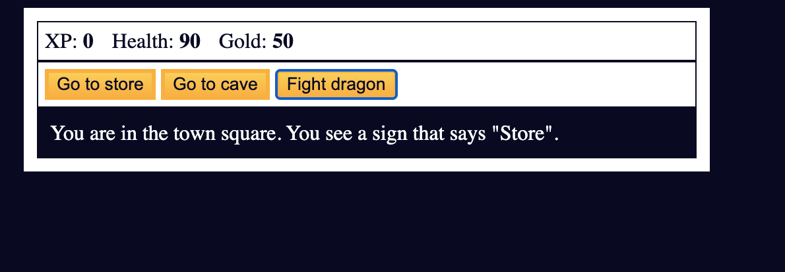
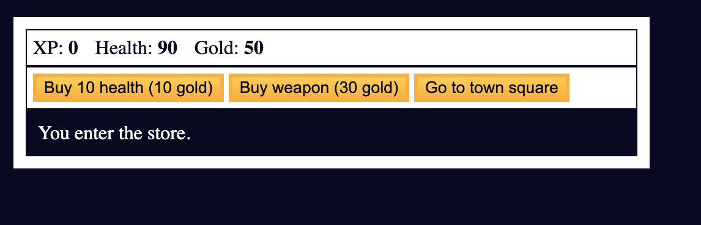
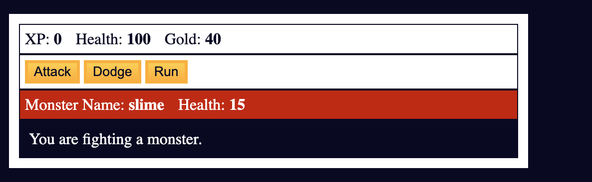
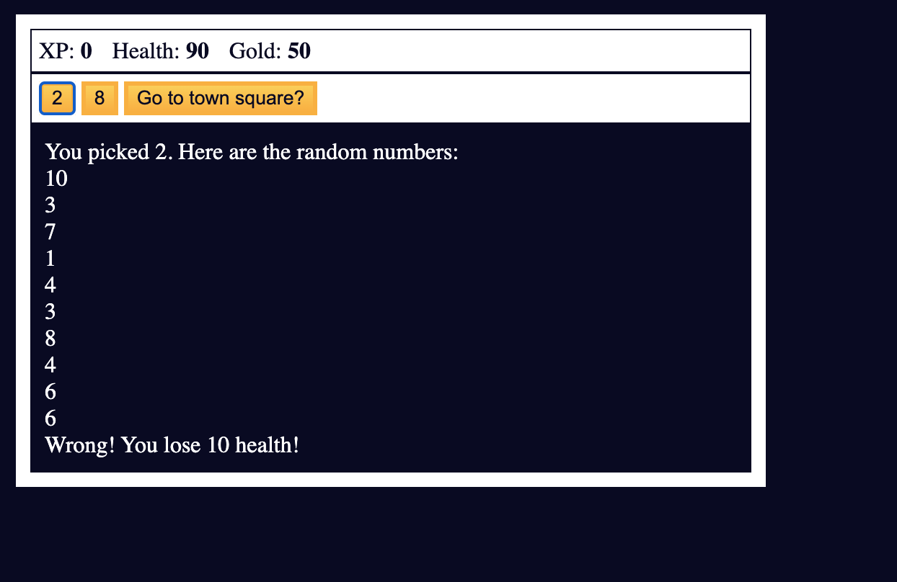

# Monster Game JS

## Description

Monster Game is a simple text-based game where the player can explore different locations, fight monsters, buy weapons and health, and play a secret mini-game. This project was created as a **guided exercise**, following instructions provided by an online learning platform.

---

## Languages and Technologies

-   **HTML** – for the page structure and buttons
-   **CSS** – for basic styling of texts and buttons
-   **JavaScript** – for the game logic, combat system, inventory management, and secret mini-game

---

## Main Features

-   Explore locations: Town Square, Store, Cave
-   Combat system with monsters (Slime, Fanged Beast, Dragon)
-   Health, gold, and experience (XP) system
-   Buy and sell weapons
-   Secret mini-game using random numbers to win gold or lose health
-   Victory and defeat screens

---

## Development Notes

-   The project was developed as a **guided project**, so much of the logic and structure follows the instructions from the learning platform.
-   The main learning goals included:
    -   DOM manipulation with JavaScript
    -   Using arrays and objects to manage monsters, weapons, and locations
    -   Conditional logic and loops (`if`, `while`, `for`)
    -   Generating random numbers with `Math.random()`

---

## How to Run the Project

1. Clone the repository to your computer:
    ```bash
    git clone https://github.com/P-Mena/Monster-game
    ```

### Screenshots

Town Square:  


Store:  


Fight Scene:  


Mini Game:  

